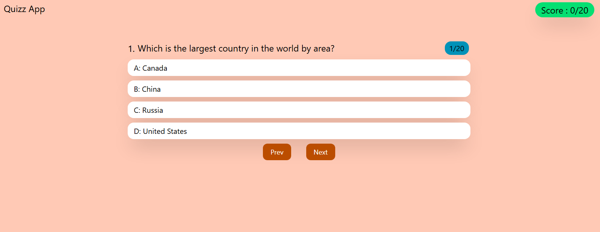

# 🧠 React Quiz App

A simple and interactive **Quiz App** built with **React.js** and **Tailwind CSS**.

The app presents users with multiple-choice general knowledge questions, keeps track of their score, provides instant visual feedback for selected answers, and displays the final score when the quiz is completed.

## 🚀 Live Demo

👉 Add your deployed project link here:

**[Live Demo](#)**

## 📸 Screenshot

> Replace `./assets/quiz.png` with the actual path and filename of your screenshot.

## ✨ Features

* 🧠 20 General Knowledge questions
* 🔘 Multiple-choice answers
* 🟢 Green feedback for correct answers
* 🔴 Red feedback for incorrect answers
* ⏱️ Automatically moves to the next question after answering
* 📊 Real-time score tracking
* 🏁 Quiz completion screen
* 🔄 Start Again functionality
* 📱 Responsive design for different screen sizes
* 🎨 Styled using Tailwind CSS

## 🛠️ Technologies Used

* **React.js**
* **JavaScript**
* **Tailwind CSS**
* **Vite**
* **HTML5**

## 🎮 How It Works

1. The quiz starts with the first question.
2. Select one of the available answers.
3. The selected answer is highlighted:

   * 🟢 Green → Correct answer
   * 🔴 Red → Incorrect answer
4. After a short delay, the next question appears automatically.
5. The score is updated when a correct answer is selected.
6. After completing all 20 questions, the final score is displayed.
7. Click **Start Again** to reset the quiz and start from question 1.

## 🧩 React Concepts Used

This project helped me practice several important React concepts:

* `useState`
* Props
* State management
* Lifting state up
* Event handling
* Conditional rendering
* Array `.map()`
* Dynamic class names
* Component-based architecture

## 📚 What I Learned

While building this project, I practiced:

* Managing application state with React
* Passing data between components using props
* Sharing state between components
* Rendering dynamic content from arrays
* Handling user interactions
* Creating reusable React components
* Building responsive layouts with Tailwind CSS
* Implementing conditional UI based on application state

## 🔮 Future Improvements

Some features I may add in the future:

* [ ] Question navigation
* [ ] Timer for each question
* [ ] Difficulty levels
* [ ] Different quiz categories
* [ ] Randomized questions
* [ ] Randomized answer options
* [ ] High-score system
* [ ] More questions
* [ ] Better animations and transitions
* [ ] Fetch questions from an API

## 👨‍💻 Author

**Hemant Kohli**

This project was built as part of my journey learning **Frontend Development with React.js**.

---

⭐ If you like this project, consider giving the repository a star!
